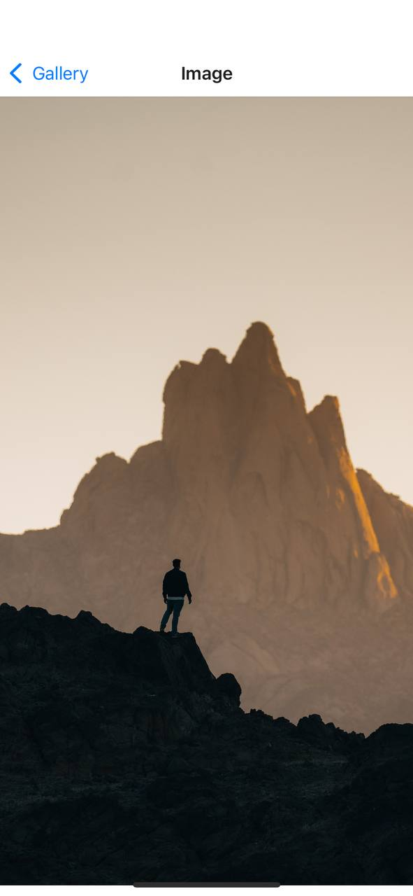

# Simple Gallery App

## Overwiev

Gallery App is a simple React Native application that leverages the Unsplash API to fetch images. The state management is handled efficiently with Redux Toolkit, making it easy to manage the app's state. 
This app is designed to showcase a gallery of images with details such as image previews, author information, and descriptions.

## To run project locally (on your phone)

* Clone the repository
* Open git bash in root folder
* Create .env file with BASE_URL to fetch images and ACCESS_KEY (read unsplash api docs for that and create an account)
* Run npm install
* Run npx expo start
* Download Expo Go via AppStore or GooglePlay
* Scan QR code from console

